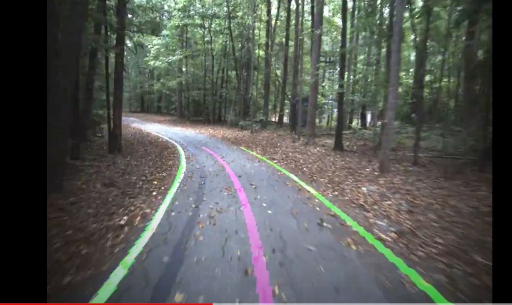
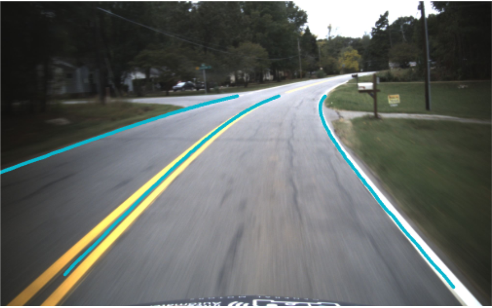
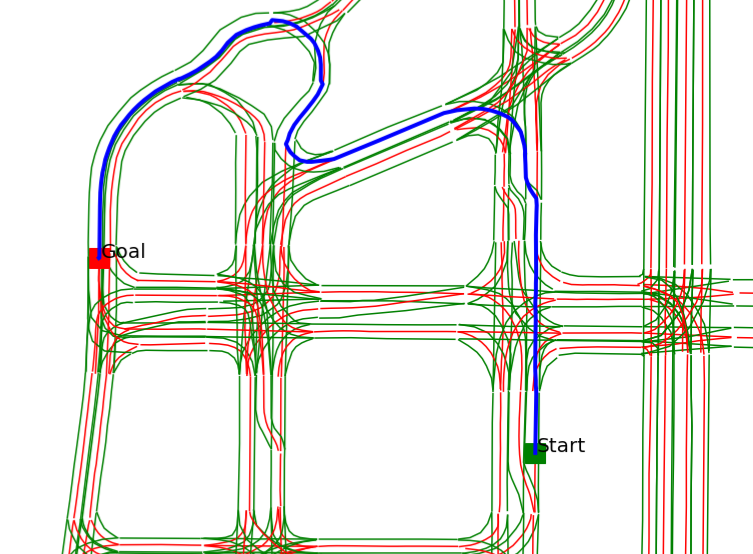
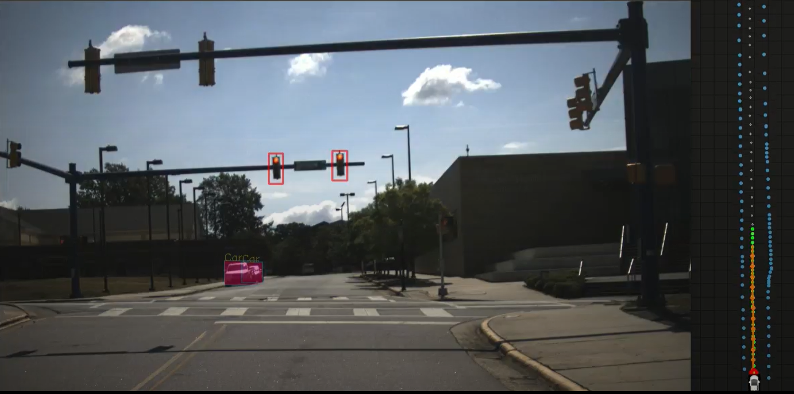

### My contributions to the NCA&T AggiesAutonomousAuto(A3) in the AutodriveChallenge

  

  The repo here is INCOMPLETE (sample code). The complete version will be released around summer 2022.

### ROS Packages
* Lane Detection 
* Route Planning using A* algorithm
* Trajectory Planner
* Traffic Light Classifer
* Model Predictive Controller (MPC)
* Software Integration

### Lane Detector
* Using edge detection and curve fitting (conventional method) 
  * Demo (earlier version): https://www.youtube.com/watch?v=gBWg0yt7hY4  
  * Presentation: https://www.youtube.com/watch?v=xIRT3rgWrFQ
  * 
  
* Using Convolutional Neural Network (deep learning)
  * Demonstration: https://www.youtube.com/watch?v=O2iV3f7KMMs
  * Presentation: https://www.youtube.com/watch?v=3bi_y9L7gpM
  * 
  
### Route Planning (A*)
* Lane level map is created in our own simple format for MCity-Ann Arbor Michigan. 
  The A* routing method is adapted for the custom map. 
*  

### Traffic Light Classifier
* 

### Model Predictive Controller (MPC)
* Demonstration of the MPC
* https://youtu.be/r_QUSNEGzO0
* https://www.youtube.com/watch?v=J-qTG7aOgX0

### Tested 
* Ubuntu 18.04 LTS
* ROS Melodic (https://wiki.ros.org/melodic/Installation/Ubuntu)
* Computer: Intel Crystal Rugged Server (https://www.crystalrugged.com/product/rs363s15f-rugged-3u-server/)
* Camera: TheImagingSource (https://www.theimagingsource.com/products/industrial-cameras/gige-color/dfk33gx265/)
* GNSS+INS: NovAtel PwrPak7 (https://novatel.com/products/receivers/enclosures/pwrpak7)
* LIDAR: Velodyne VLP-32 (https://velodynelidar.com/products/ultra-puck/)
* 

